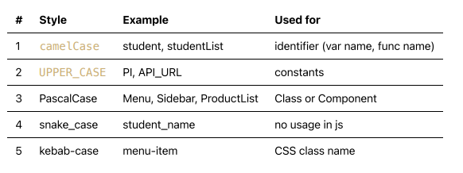

# javascript - làm quen với javascript

1. Cài đặt CSCode Extention
2. Javascript là gì ?
3. "use strict mode".
4. Làm quen với synctax trong js.
5. Biến, Cách đặt tên biến.
6. Temporal Dead Zone.
7. Hoisting.
8. Operators (toán tử).
9. Kiểu dữ liệu cơ bản.
10. Function cơ bản.

## 1. Cài đặt CSCode Extention
- [Bracket Pair Colorizer 2](https://marketplace.visualstudio.com/items?itemName=CoenraadS.bracket-pair-colorizer-2): hightlight cặp ngoặc tương ứng.
- [Javascript (ES6) code snippets](https://marketplace.visualstudio.com/items?itemName=xabikos.JavaScriptSnippets): gõ tắt trong javascript.
- [ESLint](https://marketplace.visualstudio.com/items?itemName=dbaeumer.vscode-eslint): tìm bắt lỗi javascript.
- [Prettier](https://marketplace.visualstudio.com/items?itemName=esbenp.prettier-vscode): Format code.
- [Code Runner](https://marketplace.visualstudio.com/items?itemName=formulahendry.code-runner): thực thi code trực tiếp.
- [Live Server](https://marketplace.visualstudio.com/items?itemName=ritwickdey.LiveServer): Live preview static web.
- [Material Icon Theme](https://marketplace.visualstudio.com/items?itemName=PKief.material-icon-theme): Bộ icon đẹp cho folders.

## 2. javascript là gì:

### Ngôn ngữ lập trình là gì:
Ngôn ngữ lập trình bao gồm những thành phần nào:
- synctax: bộ quy tắc hình thành nên ngôn ngữ.
- variable: cách khai báo biến.
- function: cách khai báo và sử dụng function.
- control structures: cấu trúc điều khiển.
- data structure: cấu trúc dữ liệu (cấu trúc ngôn ngữ đó hổ trợ kiểu dử liệu nào, mổi kiểu data có gì đặc biệt, và làm được gì với kiểu dữ liệu đó).
- tools: những phần mềm hỗ trợ code hiệu quả (visualstudio).

### Sự ra đời của javascript:

https://www.educative.io/blog/javascript-versions-history

Javascript không liên quan tới java vì thời điểm đó java đang thống lĩnh thị trường nên đặt tên để ké frame.

ECMAScript: là đặc tả ngôn ngữ tài liệu nó không phải là ngôn ngữ. Còn js là 1 ngôn ngữ được cài đặt theo đặc tả của ECMAScript

Trong JavaScript, "Babel" là một công cụ được sử dụng để biên dịch (hoặc chuyển đổi) mã JavaScript từ phiên bản mới nhất (ES6/ES2015) sang các phiên bản cũ hơn, phổ biến hơn mà trình duyệt web hiện đang hỗ trợ. Babel cho phép bạn viết mã JavaScript sử dụng các tính năng mới nhất của ngôn ngữ mà không cần lo lắng về việc có thể không tương thích với các trình duyệt cũ hơn.

Cụ thể, Babel thường được sử dụng để chuyển đổi mã JavaScript sử dụng cú pháp mới như Arrow Functions, Template Strings, và Class Syntax thành các phiên bản tương đương hoạt động trên các trình duyệt cũ hơn như Internet Explorer 11 hoặc phiên bản cũ của Chrome và Firefox.

Babel cũng có thể được sử dụng để thêm các tính năng hoặc plugins mà ngôn ngữ chưa hỗ trợ mặc định. Điều này giúp phát triển viên có thể sử dụng các tính năng mới một cách dễ dàng và an toàn hơn mà không cần phải lo lắng về khả năng tương thích ngược.

### Javascript làm được gì:


JavaScript là một ngôn ngữ lập trình phổ biến được sử dụng rộng rãi trong phát triển web và cả ngoài web. Dưới đây là một số ứng dụng và tính năng chính của JavaScript:

1. __Phát triển web__: JavaScript được sử dụng để tạo ra các trang web tương tác và động, từ việc thêm hiệu ứng và chức năng tương tác cho trang web cho đến phát triển các ứng dụng web phức tạp như trò chơi trực tuyến, ứng dụng đám mây, và các ứng dụng web thương mại điện tử.

2. __Front-end Development__: JavaScript là một phần quan trọng của front-end development, được sử dụng để tạo và điều khiển giao diện người dùng của trang web. Frameworks như React, Angular và Vue.js cung cấp các công cụ và thư viện mạnh mẽ để phát triển ứng dụng web front-end.

3. __Back-end Development__: JavaScript cũng có thể được sử dụng để phát triển phần back-end của ứng dụng web thông qua các framework như Node.js. Node.js cho phép các nhà phát triển sử dụng JavaScript để viết mã back-end, cho phép chia sẻ mã giữa phần front-end và back-end của ứng dụng.

4. __Ứng dụng di động__: JavaScript cũng được sử dụng trong việc phát triển các ứng dụng di động thông qua các framework như React Native và Ionic, cho phép nhà phát triển xây dựng các ứng dụng di động đa nền tảng sử dụng mã nguồn một cách hiệu quả.

5. __Game Development__: JavaScript cũng có thể được sử dụng để phát triển trò chơi trực tuyến thông qua các thư viện và framework như Phaser và Three.js.

6. __Extensions và Plugins__: JavaScript cũng được sử dụng để tạo ra các extension và plugins cho các trình duyệt web, cho phép tùy chỉnh trải nghiệm người dùng hoặc thêm các tính năng mới vào các trình duyệt.

### Thực thi code js:

cài đặt nodejs.

node index.js

code runner.

## 3. "use strict mode":

- từ ES5 có nhiều thay đổi cà conflicts với code trước đó, nên cần có cơ chế để quyết định sử dụng code mới hay cũ.
- "use strict" là cái flag để biết mình muốn dùng code mới (tức từ ES5 trờ về sau).
- hiện thì nếu ko nhắc gì thêm thì mặc định sữ có dùng "use strict".

```js
// đặt use strict ở đầu file để apply strict mocde cho toàn bộ file js này
x = 5; // bị lỗi thì có strict mode, còn trước đó vẫn chạy được
```

- khi đã bật: "use strict" thì không có cách nào cancel được.
- lưu ý là "use strict" phải được nằm ở đầu file.
- còn nếu chỉ muốn bật strict mode cho 1 hàm thì đặt nó ở đầu hàm, tuy nhiên hầy như k dùng cách này.
- khi bạn có sử dụng class hoặc module thì strict mode sẽ được bật tự động mà không cần phải thêm "use strict"

>tham khảo thêm [https://developer.mozilla.org/en-US/docs/Web/JavaScript/Reference/Strict_mode]()

## 4. làm quen với synctax trong js:
Làm quen với cú pháp (syntax) trong JavaScript là bước quan trọng đầu tiên khi học ngôn ngữ lập trình này. Dưới đây là một số khái niệm cơ bản:

1. Biến (Variables): Sử dụng để lưu trữ dữ liệu.
```js
var x = 10;
let y = 20;
const z = 30;

```

2. Kiểu dữ liệu (Data Types): Bao gồm số, chuỗi, boolean, mảng, đối tượng, và null/undefined.
```js
let num = 10;
let str = "Hello";
let isTrue = true;
let arr = [1, 2, 3];
let obj = { name: "John", age: 30 };
let empty = null;
z = 30;

```

3. Cấu trúc điều kiện (Conditional Statements): Sử dụng để thực thi các khối mã dựa trên điều kiện.

```js
if (x > 10) {
    console.log("x lớn hơn 10");
} else {
    console.log("x nhỏ hơn hoặc bằng 10");
}

```

4. Vòng lặp (Loops): Sử dụng để lặp qua một tập hợp các giá trị.

```js
for (let i = 0; i < 5; i++) {
    console.log(i);
}

while (condition) {
    // do something
}

```

5. Hàm (Functions): Một khối mã được gói lại để thực thi một công việc cụ thể.

```js
function add(a, b) {
    return a + b;
}

```

6. Phương thức (Methods): Hàm được gắn liền với một đối tượng.

``` js
let person = {
    name: "John",
    greet: function() {
        console.log("Hello, " + this.name);
    }
};

```

7. Sự kiện (Events): Các hành động người dùng khởi tạo trên trang web.

```js
button.addEventListener('click', function() {
    console.log("Button clicked!");
});

```

8. Semicolon - Dấu chấm phẩy.
- Có thể bỏ dấu chấm phẩy, nó vẫn chạy được.
- Tuỳ team mà sẽ prefer có hoặc không có dấu chấm phẩy.
- Mình thì prefer dùng dấu chấm phẩy và dùng prettier để nó tự thêm hehe
- Tuy nhiên có một số trường hợp nó sẽ hiểu sai:

```js
// mong muốn code dưới này hiểu là 2 statement (dòng lệnh) khác nhau
alert("Hello")
[1, 2].forEach(alert);
// nhưng thật ra code sẽ hiểu thế này 🤣
alert("Hello")[1, 2].forEach(alert);
// to fix, thêm dấu chấm phẩy
alert("Hello");
[1, 2].forEach(alert);

```

>Tham khảo: https://javascript.info/structure

## 5. Biến, cách đặt tên biến:

### Biến:

Cách khai báo biến trong JS

- Với ES5 thì dùng var (function scope)
- Từ ES6 thì dùng const hoặc let (block scope)
- Scope thì mình sẽ tìm hiểu sau.
- const thì dùng cho hằng số hoặc biến mà không có nhu cầu thay đổi.
- let thì dùng cho biến có mong muốn sẽ thay đổi giá trị.

Cách đặt tên cho biến

- Dùng Tiếng Anh.
- Ðặt tên để biết biến đó chứa giá trị gì.
- Không đánh đố nhau, đặt tên một đằng lưu giá trị một nẻo.
- Với true/false, đặt tên với prefix has hoặc is hoặc show hoặc từ mang ý nghĩa chỉ có nhận giá trị true
hoặc false.
- Còn lại thì dùng danh từ.
- Với dạng danh sách thì thêm suffix List

Trong JavaScript, let, const, và var đều được sử dụng để khai báo biến để lưu giá trị tạm thời, nhưng chúng có những đặc điểm và cách hoạt động khác nhau.

1. var:

var đã tồn tại từ phiên bản cũ của JavaScript và có phạm vi hoạt động là phạm vi hàm (function scope).
Biến được khai báo bằng var có thể được truy cập từ bất kỳ đâu trong hàm mà nó được khai báo.
Biến được khai báo bằng var có thể được khai báo lại và gán lại giá trị mà không gây ra lỗi.

``` js
var x = 10;

x = 15; // OK

if (true) {
    var localVar = "I'm a local var";
}

console.log(localVar); // I'm a local var
```

2. let:

let được giới thiệu trong phiên bản ECMAScript 6 (ES6) và có phạm vi hoạt động là phạm vi khối (block scope).
Biến được khai báo bằng let chỉ có thể truy cập được trong cùng một khối lệnh (block) mà nó được khai báo.
Biến được khai báo bằng let không thể được khai báo lại trong cùng một phạm vi.
``` js
let x = 10;
console.log(x); // 10

if (true) {
    let y = 20;
    console.log(y); // 20
}

console.log(y); // Lỗi: y is not defined
```

3. const:

const cũng được giới thiệu trong ES6 và có các đặc điểm giống như let, nhưng giá trị của biến được khai báo bằng const không thể được thay đổi sau khi được gán.
Biến được khai báo bằng const phải được gán một giá trị trong quá trình khai báo và không thể được khai báo lại hoặc gán lại giá trị.

``` js
const x = 10;
console.log(x); // 10

x = 20; // Lỗi: Assignment to constant variable.

const y; // Lỗi: Missing initializer in const declaration
```
Tóm lại, khi viết mã trong JavaScript, nên sử dụng const khi giá trị biến không thay đổi, và sử dụng let khi cần phải thay đổi giá trị của biến. Tránh sử dụng var nếu có thể để tránh các vấn đề về phạm vi và làm cho mã của bạn dễ bảo trì hơn.

Case styles

Một số cách ghép từ phổ biến:



## 6. Hoisting.

Trong JavaScript, "hoisting" là một quy tắc trong quá trình biên dịch mà khai báo biến và hàm được di chuyển lên đầu của phạm vi của chúng trước khi mã JavaScript thực sự được thực thi. Tuy nhiên, chỉ có phần khai báo được hoisted, còn phần gán giá trị sẽ vẫn được giữ lại ở vị trí gốc trong mã.

Khi một biến được khai báo, JavaScript sẽ "nâng cao" phần khai báo lên trên đầu của phạm vi của biến đó. Điều này có nghĩa là bạn có thể truy cập biến trước khi nó được khai báo trong mã, mặc dù giá trị của nó sẽ là undefined nếu bạn cố gắng truy cập trước khi gán giá trị.

Ví dụ:

```js
console.log(x); // undefined
var x = 10;
```

Sau khi mã trên được biên dịch, JavaScript sẽ xử lý như sau:

``` js
var x;
console.log(x); // undefined
x = 10;
```

Hãy nhớ rằng hoisting chỉ áp dụng cho phần khai báo, không phải phần gán giá trị. Điều này đối với cả biến và hàm.

## 7. Temporal Dead Zone

Trong JavaScript, "Temporal Dead Zone" (TDZ) là một khái niệm liên quan đến phạm vi và hoisting của biến được khai báo bằng let và const. Khi một biến được khai báo bằng let hoặc const, nó sẽ tồn tại trong phạm vi của block mà nó được khai báo, nhưng sẽ không thể truy cập vào giá trị của biến trước khi nó được khai báo.

TDZ diễn ra từ thời điểm khai báo biến đến thời điểm nó thực sự được gán giá trị. Trong khoảng thời gian này, bất kỳ cố gắng truy cập biến sẽ gây ra một lỗi. Điều này giúp tránh các lỗi liên quan đến sử dụng biến trước khi nó được khởi tạo, làm tăng tính dự đoán và đảm bảo an toàn trong mã JavaScript.

Ví dụ:

``` js
console.log(x); // ReferenceError: Cannot access 'x' before initialization
let x = 10;
```

Trong ví dụ này, biến x tồn tại trong TDZ từ thời điểm khai báo đến thời điểm gán giá trị. Việc truy cập x trước khi nó được khởi tạo sẽ dẫn đến lỗi.

## 8. Operators (toán tử):
### Arithmetic operators (Toán tử số học):
- Cộng: +
- Trừ: -
- Nhân: *
- Chia: /
- Chia lấy phần dư: %
- Tăng một đơn vị: ++
- Giảm một đơn vị: --
- Toán tử gán:
- Gán giá trị: =
- Gán và cộng: +=
- Gán và trừ: -=
- Gán và nhân: *=
- Gán và chia: /=
- Gán và chia lấy phần dư: %=
### Comparison operator (Toán tử so sánh):
- Bằng: ==
- Không bằng(khác): !=
- Tương đương về kiểu và giá trị: ===
- Không tương đương về kiểu hoặc giá trị: !==
- Lớn hơn: >
- Nhỏ hơn: <
- Lớn hơn hoặc bằng: >=
- Nhỏ hơn hoặc bằng: <=
### Logical operators (Toán tử logic):
- AND logic: && 
- OR logic: ||
- NOT logic: !
### Toán tử ba ngôi:
- Toán tử ba ngôi: `condition ? expr1 : expr2`
### Toán tử chuỗi:
- Nối chuỗi: + 
### Toán tử bit:
- AND bit: &
- OR bit: |
- XOR bit: ^
- Phép NOT bit: ~
- Dịch trái: <<
- Dịch phải: >>
- Dịch phải không dấu: >>>
### Toán tử typeof:
- Toán tử typeof: `typeof`

Đây chỉ là một số toán tử phổ biến, JavaScript còn có nhiều toán tử khác. Sử dụng các toán tử này để thực hiện các phép tính, so sánh, kiểm tra logic và thực hiện các tác vụ khác trong mã JavaScript

>Tham khảo thêm: https://javascript.info/operators

## 9. kiểu dữ liệu cơ bản:

Trong JavaScript, có một số kiểu dữ liệu cơ bản, bao gồm:

### Kiểu nguyên thủy
__String__: Kiểu dữ liệu này được sử dụng để biểu diễn các chuỗi ký tự. Ví dụ:

```js
var message = "Hello, world!";
```

__Number__: Kiểu dữ liệu này được sử dụng để biểu diễn các số. Cả số nguyên và số thập phân đều thuộc kiểu dữ liệu này. Ví dụ:

```js
var num = 10;
var pi = 3.14;
```

__Boolean__: Kiểu dữ liệu này chỉ có hai giá trị: true hoặc false. Nó được sử dụng để biểu diễn các giá trị logic. Ví dụ:

```js
var isTrue = true;
var isFalse = false;
```

__Null__: Biểu diễn một giá trị null, tức là không có giá trị hoặc tham chiếu đến đối tượng không tồn tại.
```js
var nullValue = null;
```

__Undefined__: Biểu diễn một biến chưa được gán giá trị, hoặc một thuộc tính không tồn tại trong đối tượng.
```js
var undefinedValue = undefined;
```
__Symbol__: Là một kiểu dữ liệu mới được giới thiệu trong ECMAScript 6, biểu diễn một giá trị duy nhất không thay đổi được, thường được sử dụng làm các khóa của thuộc tính trong đối tượng.
```js
var symbolValue = Symbol("symbol");
```
__BigInt__: Là một kiểu dữ liệu mới được giới thiệu trong ECMAScript 2020, cho phép biểu diễn các số nguyên lớn hơn giới hạn của kiểu Number.
```js
var bigIntValue = 9007199254740991n;
```

### Kiểu Object

__Object__: Kiểu dữ liệu này cho phép bạn tạo ra các đối tượng, mỗi đối tượng có thể chứa nhiều thuộc tính và phương thức. Ví dụ:

```js
var person = {
    name: "John",
    age: 30,
    isStudent: false
};
```

__Array__: Kiểu dữ liệu này cho phép bạn tạo ra các mảng, mỗi mảng có thể chứa nhiều phần tử có cùng hoặc khác kiểu dữ liệu. Ví dụ:

```js
var numbers = [1, 2, 3, 4, 5];
var fruits = ["apple", "banana", "orange"];
```

Các kiểu dữ liệu này cùng với các cấu trúc đi kèm như object và array là những khái niệm quan trọng trong JavaScript, giúp bạn xây dựng và làm việc với dữ liệu một cách linh hoạt và mạnh mẽ.


## 10. Function cơ bản:

Trong JavaScript, một hàm là một khối mã được định nghĩa một lần và có thể được gọi nhiều lần để thực thi một tác vụ cụ thể. Hàm có thể nhận đối số (arguments) và trả về một giá trị (hoặc không).

```js
// Định nghĩa một hàm tính tổng của hai số
function sum(a, b) {
    return a + b;
}

// Gọi hàm và truyền đối số
var result = sum(5, 3);

console.log(result); // Output: 8
```

Thành phần cấu tạo nên function
- Từ khoá function
- Tham số hàm (arguments): optional, chỉ nên tối đa có 3 tham số.
- Boby
- Return statement: optional

```js
function printMessage(message) {
 console.log(message)
}

function sumTwoPositive(a, b) {
 // IMPORTANT: check a and b should be positive
 if (a <= 0 || b <= 0) return -1; // should return -1 instead of
null/undefined
 return a + b;
}
```

Cách đặt tên cho function
- Dùng Tiếng Anh
- Dùng động từ vì function là để thực hiện một nhiệm vụ nào đó.
- Thường hay dùng với prefix: create, update, add, check, convert, map, get, ...

Một số ví dụ về tên hàm

```js
function addNewStudent() {}
function getAllStudents() {}
function convertNumberToString() {}
function checkIfPositive() {}
function updateProduct() {}
function removeTodo() {}
// ...
```

Một số lưu ý khi viết function
- Mỗi hàm chỉ làm 1 nhiệm vụ, và làm thật tốt nhiệm vụ đó.
- Nên giữ code của 1 hàm ngắn thôi, dưới 30 dòng code.
- Trường hợp ngoại lệ nhiều code hơn, tuy nhiên những hàm này ít thôi.
- Luôn kiểm tra tính hợp lệ của tham số ở đầu hàm.
- Return kiểu dữ liệu đồng nhất với nhau.
- Nên có comments cho những logic phức tạp.
- Chỉ nên có tối đa là 3 tham số truyền vào.
> Tham khảo thêm: https://javascript.info/function-basics

